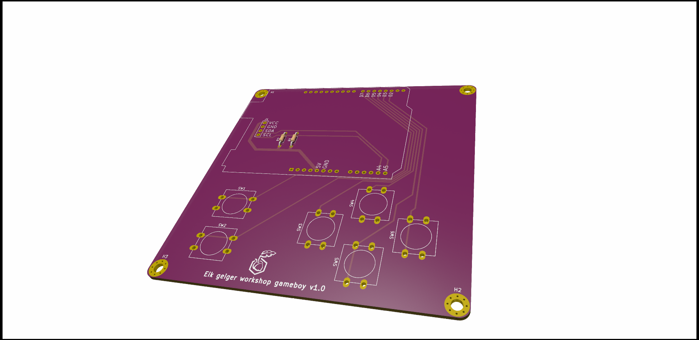
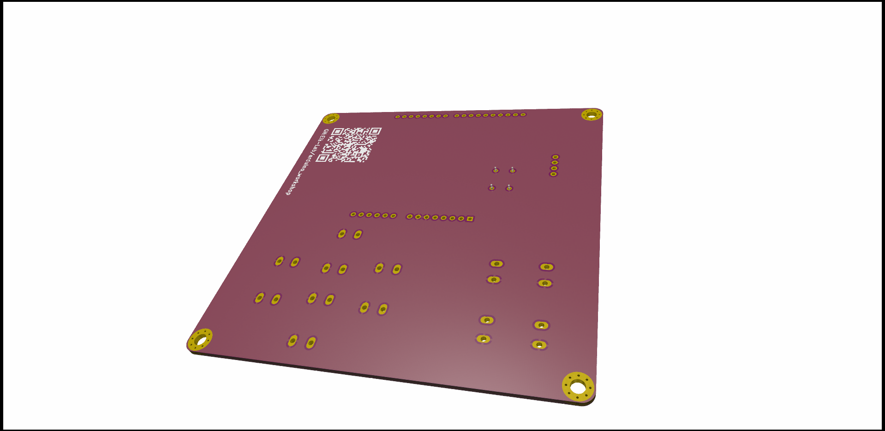

# ARDUINO-GAMEBOY

INFO INFO

[SCHEMATIC](./DOCUMENTATION/arduino_gameboy-Schematic.pdf)

[Assembly IBOM](https://htmlpreview.github.io/?https://raw.githubusercontent.com/fredriknk/arduino_gameboy/main/DOCUMENTATION/arduino_gameboy-ibom.html)

## FRONT

## BACK

## EXTRA INFO

INFO INFO
